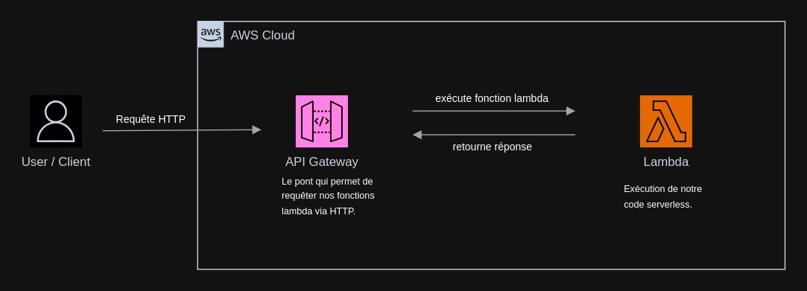

Docker sur AWS Lambda
---------------------

Ce guide vous montrera comment déployer une mini api NodeJS sur AWS Lambda avec le framework Serverless. Cette fonction utilise Puppeteer pour générer un PDF à partir d'une URL ou d'un code HTML.

**Prérequis:**

1. Avoir un compte AWS.
2. Avoir Node.js et NPM installés.
3. Avoir Serverless Framework installé.
4. Avoir Docker installé.

**Étapes:**

1. Clonez le dépôt et aller dans le dossier `exemples/serverless/nodejs-docker-html2pdf`.
2. Installez les dépendances node nécessaires.
3. Déployez l'API avec la commande `sls deploy`.

Une fois le déploiement terminé, vous devriez voir l'URL de votre API dans la console. Vous pouvez maintenant faire des requêtes à votre API déployée sur AWS Lambda.

----------------------------------------------

**Note sur la configuration de Serverless:**

Dans le fichier serverless.yml, une seule fonction est configurée pour l'API NodeJS Docker HTML2PDF. Cette fonction est déclenchée par une requête HTTP POST et génère un PDF à partir de l'URL ou du code HTML fourni dans le corps de la requête.

----------------------------------------------

**Schéma**

