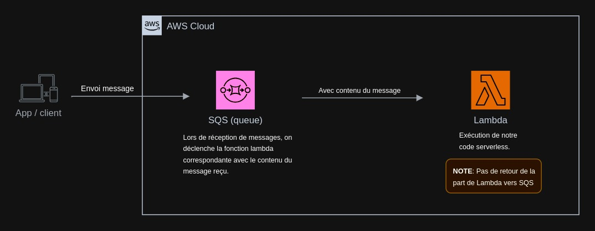

Exemple NodeJS SQS
------------------

Ce projet est un exemple d'utilisation de AWS SQS (Simple Queue Service) avec Node.js et le framework Serverless.

## Prérequis

- Node.js
- AWS CLI configuré avec vos identifiants AWS
- Framework Serverless installé globalement (`npm install -g serverless`)

## Installation

1. Clonez le dépôt
2. Installez les dépendances avec `npm install`

## Configuration

Mettez à jour le fichier `serverless.yml` avec vos informations :

- [service](exemples/serverless/nodejs-sqs/serverless.yml#3%2C1-3%2C1): le nom de votre service
- `provider.region`: la région AWS que vous souhaitez utiliser
- `provider.environment.SQS_QUEUE_NAME`: le nom de votre file SQS

## Déploiement

Déployez le service avec la commande `serverless deploy`.

## Utilisation

Le fichier `processOrder.js` contient une fonction AWS Lambda qui est déclenchée chaque fois qu'un message est reçu dans la file SQS. La fonction récupère le message, le traite et le supprime de la file.

Actuellement, la fonction se contente de parser le message et de l'afficher dans la console. Vous pouvez remplacer la section `// todo: faire votre traitement` par votre propre logique de traitement.

## Test

Pour tester, vous pouvez envoyer un message à votre file SQS via la console AWS ou via l'API AWS SQS. La fonction Lambda sera automatiquement déclenchée et traitera le message.

## Nettoyage

Pour supprimer le service, utilisez la commande `serverless remove`.  
A noter que cela va aussi supprimer toutes les ressources que vous avez creer sous `resources:`, donc la file SQS sera également supprimée dans ce cas.

### Schéma

